# Vivaran - AI-Powered Document Analysis Platform

Vivaran is a sophisticated Kotlin Multiplatform mobile application that leverages AI to analyze and process various types of documents. Built for Android and iOS, it provides intelligent insights for medical reports, insurance claims, farmer schemes, and general document analysis.

## 📱 Screenshots

<div align="center">

| Authentication | Dashboard | Agent Selection |
|:---:|:---:|:---:|
|  |  |  |
| Secure OAuth login | Main dashboard with quick actions | Choose specialized AI agents |

| Document Upload | Analysis Results | History |
|:---:|:---:|:---:|
|  |  |  |
| Intuitive document upload | Detailed analysis insights | Previous sessions |

</div>

> **📸 How to Add Screenshots:**
> 1. Run your app on Android/iOS device or simulator
> 2. Navigate through each screen (Auth → Dashboard → Agent Selection → Upload → Results → History)
> 3. Take screenshots and save them as PNG files in the `screenshots/` directory
> 4. Use the exact filenames shown above for proper display

## 🌟 Features

### 🔍 **AI-Powered Document Analysis**
- **Medical Report Analysis**: Analyze medical bills, prescriptions, and health reports
- **Insurance Claim Optimization**: Optimize insurance claims and coverage analysis  
- **Farmer Scheme Eligibility**: Check eligibility for Indian government farmer schemes
- **General Document Summarizer**: Summarize and analyze any document type

### 📱 **Cross-Platform Support**
- Native Android and iOS applications
- Shared business logic and data layer
- Consistent UI/UX across platforms

### 🔐 **Secure Authentication**
- OAuth integration for secure login
- User session management
- Firebase integration for backend services

### 📊 **Rich User Experience**
- Modern Material Design 3 UI
- Document upload with real-time progress
- Analysis history and session management
- Agent-based document processing workflow

## 🎯 What Makes Vivaran Special

### 🏥 Medical Document Intelligence
- **Prescription Analysis**: Extract medications, dosages, and instructions
- **Lab Report Processing**: Identify abnormal values and health indicators
- **Insurance Claim Optimization**: Maximize claim amounts with AI suggestions

### 🌾 Government Scheme Assistant
- **Farmer Scheme Eligibility**: Check qualification for PM-KISAN, crop insurance
- **Document Verification**: Validate required documents for applications
- **Application Guidance**: Step-by-step application process assistance

### 🤖 AI-Powered Features
- **Multi-language OCR**: Extract text from images in multiple Indian languages
- **Smart Classification**: Automatically categorize document types
- **Contextual Analysis**: Understand document context for better insights
- **Real-time Processing**: Get results in under 30 seconds

## 🏗️ Architecture

### **Kotlin Multiplatform**
```
├── composeApp/          # UI Layer (Compose Multiplatform)
│   ├── androidMain/     # Android-specific code
│   ├── iosMain/        # iOS-specific code
│   └── commonMain/     # Shared UI code
│
└── shared/             # Business Logic Layer
    ├── androidMain/    # Android platform implementations
    ├── iosMain/       # iOS platform implementations
    └── commonMain/    # Shared business logic
```

### **Key Components**
- **Data Layer**: Repository pattern with network and local data sources
- **Domain Layer**: Business models and entities
- **Presentation Layer**: MVVM architecture with Compose UI
- **Dependency Injection**: Koin for clean dependency management

## 🚀 Getting Started

### Prerequisites
- Android Studio Hedgehog or later
- Xcode 15+ (for iOS development)
- Kotlin 2.0.20+
- Gradle 8.9+

### Setup
1. Clone the repository:
   ```bash
   git clone https://github.com/suyash-frozo/vivaranKMPApp.git
   cd vivaranKMPApp
   ```

2. Open in Android Studio or IntelliJ IDEA

3. Sync Gradle files

4. Configure Firebase:
   - Add `google-services.json` for Android
   - Add `GoogleService-Info.plist` for iOS

### Build & Run

**Android:**
```bash
./gradlew :composeApp:assembleDebug
```

**iOS:**
```bash
./gradlew :composeApp:iosSimulatorArm64Test
```

## 📋 User Flow

```mermaid
graph TD
    A[🔐 Authentication] --> B[📊 Dashboard]
    B --> C[🤖 Agent Selection]
    C --> D[📤 Document Upload]
    D --> E[⚡ AI Processing]
    E --> F[📋 Results Display]
    F --> G[📚 History]
    G --> B
    B --> G
```



### Step-by-Step Workflow

1. **🔐 Authentication**: Secure login via OAuth (Google, Facebook, etc.)
2. **📊 Dashboard**: Overview of features, recent analyses, and quick actions
3. **🤖 Agent Selection**: Choose specialized AI agent based on document type:
   - 📄 Medical Report Analysis
   - 🛡️ Insurance Claim Optimization  
   - 🌾 Farmer Scheme Eligibility
   - 📊 General Document Summarizer
4. **📤 Document Upload**: Upload PDF, JPEG, or PNG files with drag-and-drop
5. **⚡ AI Processing**: Real-time analysis with progress tracking and ETA
6. **📋 Results Display**: Detailed insights, recommendations, and actionable items
7. **📚 History**: Access previous analysis sessions and download reports

## 🛠️ Technology Stack

### **Core Technologies**
- **Kotlin Multiplatform**: Shared business logic
- **Compose Multiplatform**: Modern declarative UI
- **Ktor**: HTTP client for API communication
- **Kotlinx Serialization**: JSON serialization/deserialization

### **Architecture & DI**
- **Koin**: Dependency injection framework
- **MVVM Pattern**: Clean separation of concerns
- **Repository Pattern**: Data access abstraction

### **Platform Integration**
- **Firebase**: Authentication and backend services
- **Material Design 3**: Modern UI components
- **Kotlinx Coroutines**: Asynchronous programming

## 📦 Modules

### **composeApp**
Main application module containing:
- UI screens and navigation
- ViewModels and state management
- Platform-specific implementations
- Theme and styling

### **shared**
Shared business logic module containing:
- Data repositories and network services
- Domain models and entities
- Dependency injection setup
- Utility functions

## 🔧 Configuration

### **Environment Setup**
Configure the following in `gradle.properties`:
```properties
# API Configuration
vivaran.api.baseUrl=https://api.vivaran.com
vivaran.api.timeout=30000

# Firebase Configuration
firebase.enabled=true
```

## 🤝 Contributing

1. Fork the repository
2. Create a feature branch (`git checkout -b feature/amazing-feature`)
3. Commit your changes (`git commit -m 'Add amazing feature'`)
4. Push to the branch (`git push origin feature/amazing-feature`)
5. Open a Pull Request

## 📄 License

This project is licensed under the MIT License - see the [LICENSE](LICENSE) file for details.

## 🔮 Future Roadmap

- [ ] Multi-language document support
- [ ] Advanced OCR capabilities
- [ ] Offline analysis mode
- [ ] Custom AI agent creation
- [ ] Document collaboration features
- [ ] API integrations with government services

## 📞 Support

For support, email support@vivaran.com or create an issue in this repository.

---

**Vivaran** - Transforming document analysis with AI intelligence.